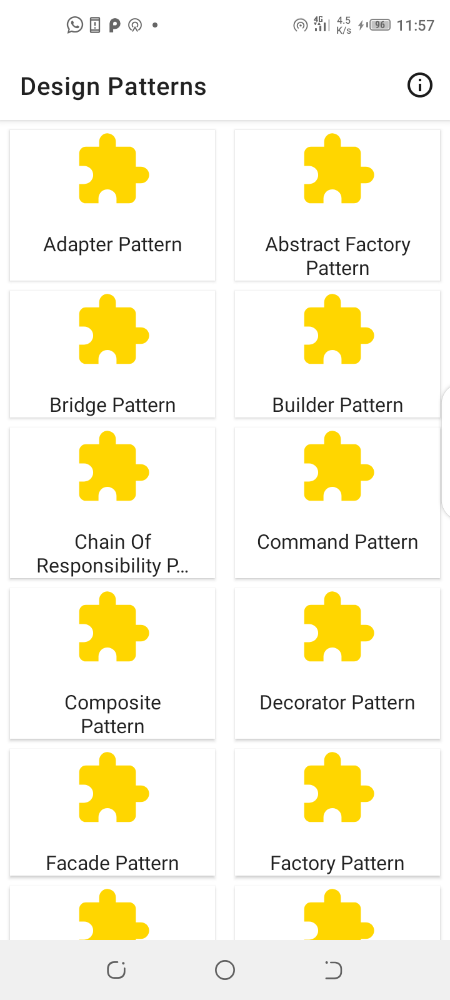
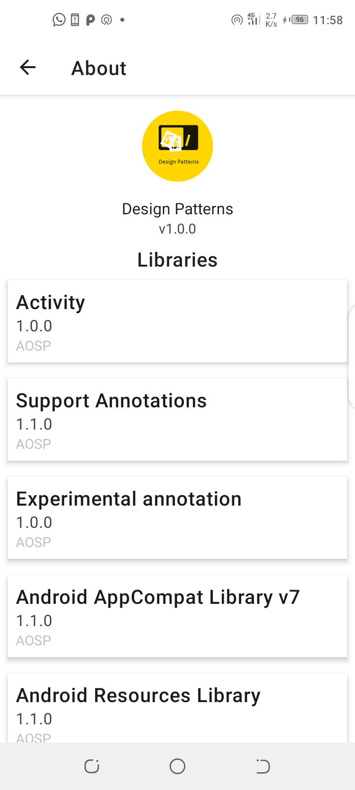
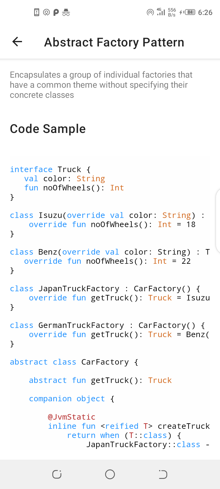

<p align="center">

</p>
<p align="center">
<a href="https://www.codacy.com?utm_source=github.com&amp;utm_medium=referral&amp;utm_content=odaridavid/Design-Pattern-Samples-App&amp;utm_campaign=Badge_Grade"></a>

</p>

## Design Patterns

Exploring Behavioral,Creational and Structural Design Patterns

Feel free to improve or provide feedback on any of the patterns.

## More References

- [Design-Patterns-In-Kotlin](https://github.com/dbacinski/Design-Patterns-In-Kotlin)
- [Refactoring Guru Design Patterns](https://refactoring.guru/design-patterns)

And Some Wikipedia.🙃

## Screenshots

|||||
|:--:|:--:|:--:|:--:|


## License

```
  Copyright 2020 David Odari
 
  Licensed under the Apache License, Version 2.0 (the "License"); 
  you may not use this file except in compliance with the License. You 
  may obtain a copy of the License at.
             http://www.apache.org/licenses/LICENSE-2.0
  Unless required by applicable law or agreed to in writing, software 
  distributed under the License is distributed on an "AS IS" BASIS, 
  WITHOUT WARRANTIES OR CONDITIONS OF ANY KIND, either express or implied.
  See the License for the specific language governing permissions and
  limitations under the License.
```
